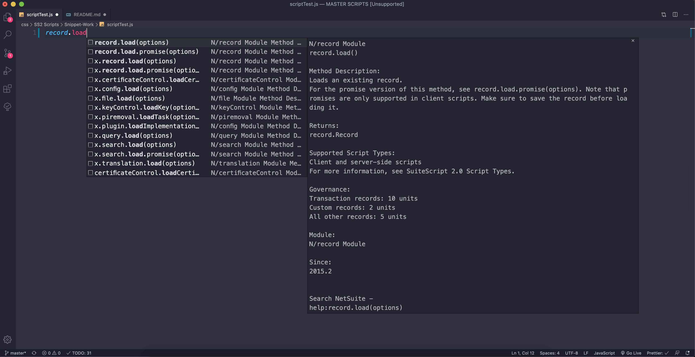
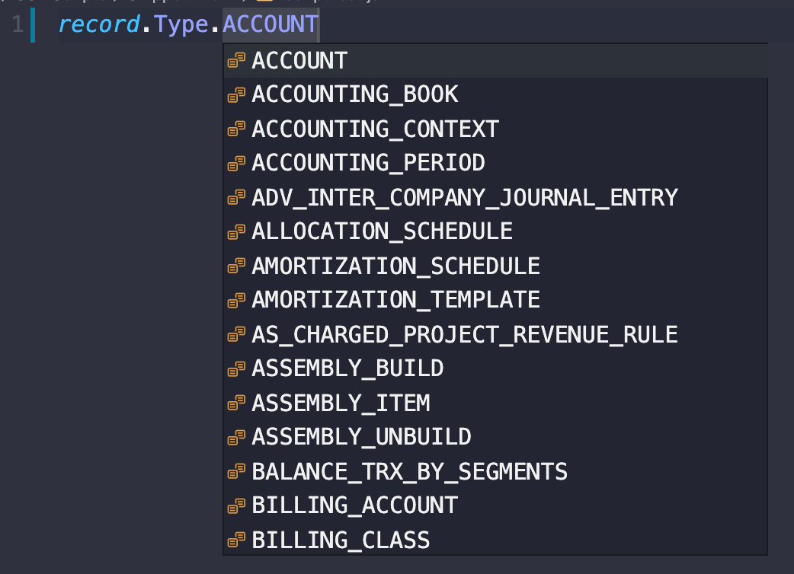

# <b>SuiteSnippets

This is an extention that contains snippets useful for writing SuiteScript 2.0 (or 2.X) for NetSuite.</b>

<li>All Information within these snippets was scraped from NetSuites Help Documents.

## Installing

Download this as a .zip
 Unzip the folder, and drop that folder into your VS Code extension folder

 Windows --- %USERPROFILE%\. vscode\extensions.
 macOS --- ~/. vscode/extensions.
 Linux --- ~/. vscode/extensions.

<b>Q: Why didn't you just make it available on the VS Code Marketplace?</b>
 A: I can't figure out how.
 <b>CAN YOU HELP ME??
  PLEASE HELP ME</b> Message me on the NetSuite Professionals Slack <b>@dark black t-shirt</b>

## Snippet Format

<ul>
<li><b>Prefix:</b>  SuiteScript method or property
<li><b>Description:</b> Information from the first table displayed in NetSuites help document for that particular method or property. (Description, Returns, Supported Script Types, Governance, etc.)
<li><b>Body:</b> 
<ul><li><b>Methods:</b> Display the piece of code needed to call them and provide tab stops to update options quickly
<li><b>Properties:</b> Generally provide a link to the NetSuite Help Documents 
</ul>
</uL>

# <b>Snippets</b>

You can type things like "**record.**" and you will see options for "**record.load**", "**record.copy**", "**record.attach**", etc.

## <b>Snippet</b> Example

record.load(options)

<pre>
record.load({
    type: string*,
    id: number*,
    isDynamic: boolean true | false,
    defaultValues: Object
})</pre>

<b>Notes:</b>

<ul>
<li>First tab stop allows you to rename "record" to "r" or anything else you imported the module as
<li>After that, each value is a tab stop
<li>Default value of each key-value pair is the expected type
<li>Values ending with * indicate mandatory values
</ul>

# <b>Example Codes</b>

Also provided are code samples from the NetSuite Help Documentation.
 Simply add "x." to the begining of your results and you will see any code samples NetSuite has provided.

## <b>Example Codes</b> Example

x.record.load

<pre>
// Code Example 1
// Add additional code.
//...

// Load a sales order.

var objRecord = record.load({
    type: record.Type.SALES_ORDER, 
    id: 157,
    isDynamic: true,
});

// Load an instance of a custom record type with the ID customrecord_feature.

   var newFeatureRecord = record.load({
    type: 'customrecord_feature',
       id: 1,
       isDynamic: true                       
   });
...   
// Add additional code. 
</pre>

# <b>Enumerations</b>

Also provided are enumerations from NetSuite Help Documents.
 When typing in the prefix of the enumeration, select the Enum snippet to populate a list of available enumerations.

## <b>Enumeration</b> Example

record.Type

# <b>SUGGESTION</b>

To make this the most effect, I made my suggestion tree and details box wider. (As shown in the first image)

This link brings you to an issue comment that allow you to make the suggestion tree and details wider:
https://github.com/microsoft/vscode/issues/53565#issuecomment-405448123

## <b>ABOUT ME</b>

Hi, my name is <i>Eric Birdsall</i>
 I'm a self taught programmer originally from upstate New York
 <b>I believe in making tools that can be used to make tools</b>
  I hope you find this to be one of those tools

http://ericbirdsall.dev
 <i>Please excuse my website, it is</i> <b>bad.</b>
